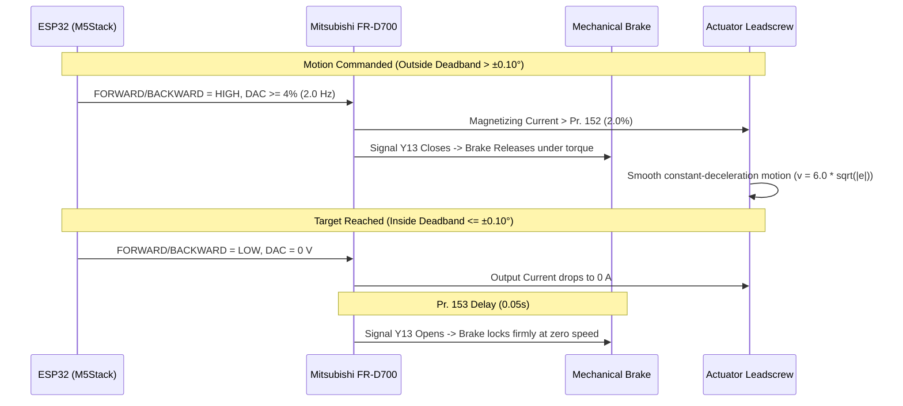

# Mitsubishi FR-D700 VFD & Firmware Configuration Guide

This document describes the optimal parameter settings for the **Mitsubishi FR-D700** variable frequency drive (VFD) coupled with the mechanical holding brake and the non-linear square-root lift controller on the ESP32 (M5Stack ATOM).

---

## 1. VFD Parameter Settings (FR-D700)

| Parameter | Function | Value | Description |
| :--- | :--- | :--- | :--- |
| **`Pr. 13`** | Starting Frequency | **`2.0 Hz`** | Minimum output frequency when motion is commanded. Matched to firmware `LIFT_MIN_DRIVE_PCT = 4.0%` ($4\% \times 50\text{ Hz} = 2.0\text{ Hz}$). |
| **`Pr. 152`** | Zero Current Detection Level | **`2.0 %`** | Threshold current above which output signal **Y13** activates (releasing the mechanical brake under magnetic flux). |
| **`Pr. 153`** | Zero Current Detection Delay | **`0.05 s`** | Delay before signal **Y13** drops when current falls to zero. Setting this to $0.05\text{ s}$ ($50\text{ ms}$) ensures immediate, shock-free mechanical brake locking at standstill. |

---

## 2. Firmware Controller Parameters (`include/config.h`)

```cpp
#define LIFT_SQRT_GAIN_DEFAULT    6.0f       // Square-root gain (% / sqrt(mm))
#define LIFT_DEADBAND_DEG_DEFAULT 0.10f      // Deadband angle tolerance (± 0.10 deg)
#define LIFT_MIN_DRIVE_PCT        4.0f       // Minimum moving speed floor (matches Pr. 13 @ 2.0 Hz)
#define LIFT_MAX_DRIVE_PCT        100.0f     // Maximum speed percentage (100% = 5V DAC)
```

---

## 3. Dynamic Sequence


